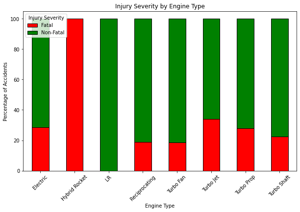
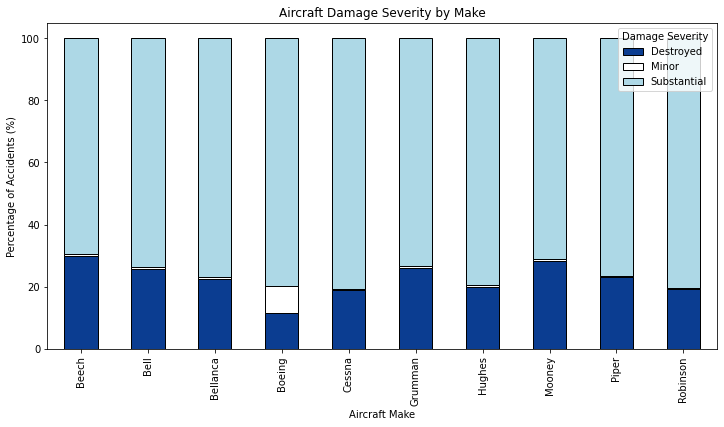

# Aviation Accidents Analysis

**Author**: Valary Kones

## Overview

My company is expanding into new industries to diversify its portfolio, with a specific interest in purchasing and operating aircraft for commercial and private enterprises. This project uses descriptive statistical analysis on aviation accident data from 1962–2023 to gain insights into which aircraft are the safest and lowest risk for the company to start with.

The analysis focuses on three main questions: which aircraft make has the highest survival rate, which is least likely to suffer total damage during an accident, and which engine type is associated with the lowest risk. After cleaning the data, I filtered the results to the top 10 most popular aircraft models, as including all 6,932 makes would have been unwieldy and could skew survival rates due to small aircraft with very few passengers.

From the results, my recommendation is that Cessna aircraft with Reciprocating Engines or Boeing aircraft with Turbo Fan Engines are good investments for commercial enterprises, as these combinations demonstrate the highest survival rates and structural resilience. I used data cleaning, analysis, and visualization to support these recommendations.

Note: A separate analysis is needed for smaller aircraft typically used in private or niche markets, as their risk profiles may differ significantly from larger commercial planes

## Business Problem


My company is exploring expansion into the aviation industry and is considering purchasing and operating aircraft for commercial and private use. I am tasked with identifying aircraft that present the lowest operational risk. To guide this analysis, I plan to investigate the following questions:

1. Engine Type and Safety: How does engine type correlate with accident severity and which engine type is associated with the lowest risk of severe accidents?          
2. Survivability: What is the survival rate for each aircraft, and which makes have the highest survival rates (i.e., the fewest fatalities)?
3. Structural Resilience: Which aircraft demonstrate greater structural resilience, where accidents resulted in damage that was significant but not total or catastrophic?

Answering these questions will help guide the new aviation division on which aircraft to purchase.


***

## Data

The data provided is from the National Transportation Safety Board that includes aviation accident data from 1962 to 2023 about civil aviation accidents and selected incidents in the United States and international waters.

This data had 31 columns, showing the date,year, location, aircraft make, model and number of fatalities etc., of each accident during this time period.The data was not only limited to aircrafts but other aerial vehicles like hot air balloons, gliders and rockets.
***

## Methods
 * Data Cleaning

After getting a brief look at the dataset, I dropped 15 columns that were not needed for my analysis.
I computed and added columns that were necessary for my data analysis, such as: Survivors, Total Passengers and Survival rate to my dataframe. 
I also filled in null values to my relevant columns (Total Fatal Injuries, Total Minor Injuries etc.)
For columns like Engine type and Aircraft Damage, I dropped any rows with null values.
I also made sure there were no redundant values. This was the case for columns like Make and Injury severity where similar categories were classed as different due to difference in the case used(uppercase vs lowercase)

 * Data Visualization
 After Data  cleaning I prepared 3 charts to answer my 3 data questions.
 1. Engine Type and Safety: How does engine type correlate with accident severity and which engine type is associated with the lowest risk of severe accidents?          
2. Survivability: What is the survival rate for each aircraft, and which makes have the highest survival rates (i.e., the fewest fatalities)?
3. Structural Resilience: Which aircraft demonstrate greater structural resilience, where accidents resulted in damage that was significant but not total or catastrophic?
***

## Results

The Engine types with the lowest fatality rates are Reciprocating Engine and Turbo Fan. Some Engines have 100% fatality rates



Charting the top 10 most popular aircrafts with their survival rates showed that most of these aircrafts have a relatively high survival rate. Boeing had one of the highest survival rates: 93%.


When analysing aircraft damage(whether total,substantial or minor) by make. We find that a large % of the accidents result in substantial aircraft damage. Boeing has the least percentage of total damage vs minor vs substantial.



***

***


## Conclusions

This analysis leads to three recommendations regarding types of aircrafts the company should use:-

* Recommendation One: The company should prioritize aircraft makes with Reciprocating Engines or Turbo Fan Engines, as these engine types are associated with the lowest fatality rates—approximately 18% fatal and 80% non-fatal.
* Recommendation Two: Among the top 10 aircraft makes, survival rates are generally high and fairly similar. However, I recommend Boeing, which has the highest survival rate at 94%, or Hughes, with a survival rate of 93%.
* Recommendation Three: Boeing appears to be the sturdiest aircraft, as it has the lowest proportion of destroyed aircrafts at 11%
                     
Project Limitations- I focused on the top 10 most popular aircraft models to simplify the analysis and highlight larger, commercial-use planes, as including all 6,932 makes would have been unwieldy and could skew survival rates towards very small aircrafts which had 2 or 3 passengers. While this provides useful insights for high-capacity aircrafts, it does not fully address risks for smaller planes, which are common in private aviation. 

Future analysis should evaluate these smaller aircraft to guide recommendations for private enterprises or niche markets.
***

### Tableau Dashboard for Aviation Accidents

Below is a Dashboard of my  Aviation accidents analysis
For a full view of the Dashboard:
[Aviation.viz](https://public.tableau.com/views/Aviationviz_17594164483220/AviationaccidentsDashboard?:language=en-US&:sid=&:redirect=auth&:display_count=n&:origin=viz_share_link)


[](https://public.tableau.com/views/Aviationviz_17594164483220/AviationaccidentsDashboard?:language=en-US&:sid=&:redirect=auth&:display_count=n&:origin=viz_share_link)


## Repository Structure


```
├── data                          
├── images
├── .gitignore        
├── Presentation.pdf
├── README.md                             
└── student.ipynb                           
```


